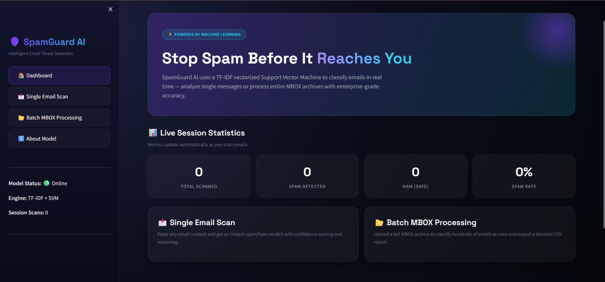
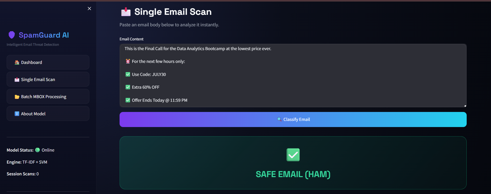
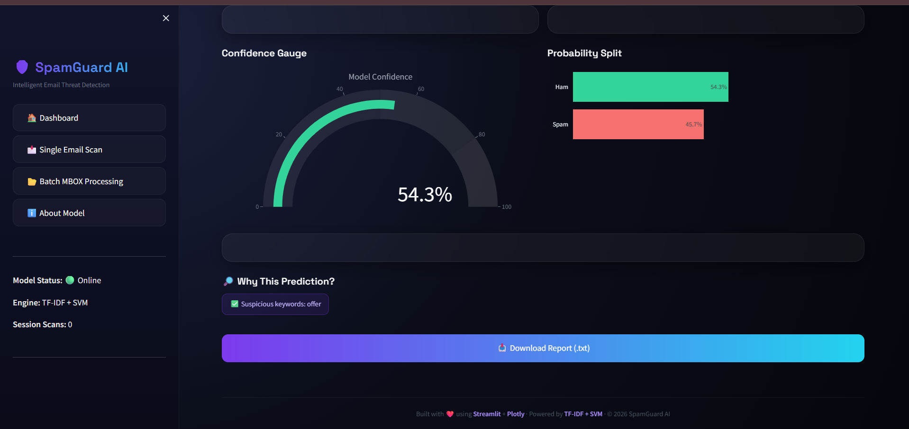
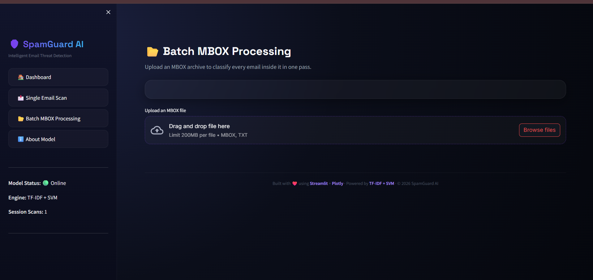
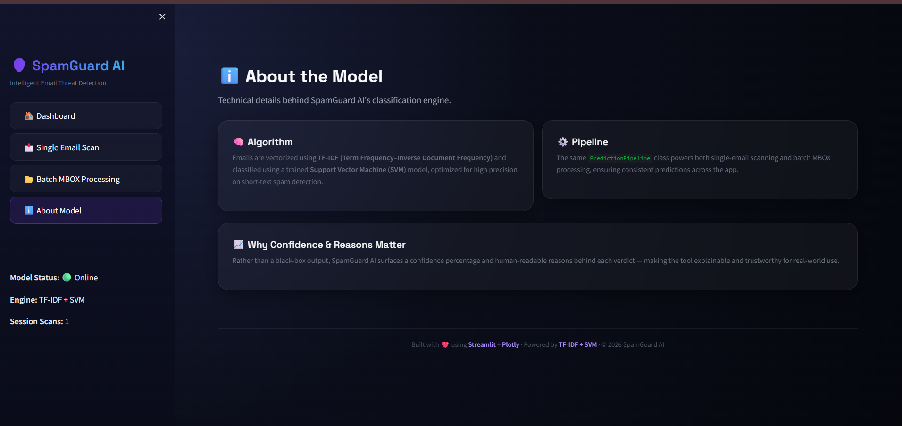

# 📧 Spam Email Classification System

<div align="center">


### 🚀 AI-Powered Spam Email Detection using Machine Learning

*A modern Streamlit dashboard for detecting Spam and Ham emails with real-time predictions, confidence scores, batch processing, and model analytics.*

</div>

---

# 📖 Overview

Spam Email Classification System is a production-ready Machine Learning application that classifies emails into **Spam** or **Ham (Legitimate)**.

The project uses Natural Language Processing (NLP) techniques combined with Machine Learning algorithms to analyze email content and predict whether an email is spam.

The application features a modern AI-inspired Streamlit dashboard designed for both individual email prediction and bulk email analysis.

---

# ✨ Features

## 🤖 AI Email Classification

- Detect Spam and Ham emails instantly
- Real-time prediction
- Confidence score for every prediction
- Fast preprocessing pipeline

---

## 🎨 Modern Dashboard

- Clean AI-inspired UI
- Responsive layout
- Dark professional theme
- Interactive prediction cards
- Animated loading indicators

---

## 📂 Batch Email Processing

- Upload `.mbox` email archives
- Analyze hundreds of emails
- Download prediction results as CSV
- Progress indicators

---

## 📊 Analytics

- Prediction confidence
- Processing statistics
- Model information
- Performance metrics

---

## 🧠 Machine Learning Pipeline

The project follows a modular ML architecture.

- Data Ingestion
- Data Validation
- Data Transformation
- Model Training
- Model Evaluation
- Prediction Pipeline

---

# 🛠 Tech Stack

| Category | Technology |
|-----------|------------|
| Language | Python 3.10+ |
| Frontend | Streamlit |
| Machine Learning | Scikit-Learn |
| Data Processing | Pandas, NumPy |
| NLP | TF-IDF Vectorizer |
| HTML Parsing | BeautifulSoup4 |
| Serialization | Pickle |
| Version Control | Git & GitHub |

---

# 📁 Project Structure

```
Spam-Email-Detection/
│
├── app.py
├── main.py
├── requirements.txt
│
├── data/
│   └── dataset/
│
├── outputs/
│   ├── models/
│   ├── vectorizers/
│   └── metrics/
│
├── logs/
│
├── src/
│   ├── components/
│   │   ├── data_ingestion.py
│   │   ├── data_transformation.py
│   │   ├── model_trainer.py
│   │   └── model_evaluation.py
│   │
│   ├── config/
│   ├── pipeline/
│   │   ├── training_pipeline.py
│   │   └── prediction_pipeline.py
│   │
│   └── utils/
│
└── README.md
```

---

# ⚙ Installation

## 1️⃣ Clone Repository

```bash
git clone https://github.com/shwetacoder503/Spam-Email-Detection.git
```

```bash
cd Spam-Email-Detection
```

---

## 2️⃣ Create Virtual Environment

### Windows

```bash
python -m venv .venv
```

```bash
.venv\Scripts\activate
```

### Linux / macOS

```bash
python3 -m venv .venv
```

```bash
source .venv/bin/activate
```

---

## 3️⃣ Install Dependencies

```bash
pip install -r requirements.txt
```

---

# 🚀 Running the Application

Launch Streamlit

```bash
streamlit run app.py
```

The application will automatically open in your browser.

Default URL

```
http://localhost:8501
```

---

# 💻 Dashboard Modules

## 📝 Single Email Prediction

Paste an email into the text area.

Click **Classify Email**

You'll receive:

- Spam/Ham prediction
- Confidence score
- Processing status
- Prediction card

---

## 📂 Batch Prediction

Upload an `.mbox` file.

The application will:

- Read all emails
- Predict Spam/Ham
- Display results
- Export CSV

---

# 🧠 Machine Learning Models

The training pipeline evaluates multiple ML algorithms including:

- Support Vector Machine (SVM)
- Logistic Regression
- Decision Tree
- Random Forest

The best-performing model is automatically selected for deployment.

---

# 📊 Evaluation Metrics

The models are evaluated using:

- Accuracy
- Precision
- Recall
- F1 Score
- Cross Validation

Performance reports are stored inside the `outputs/` directory.

---

# 🔄 Training Your Own Model

Place your dataset inside

```
data/dataset/dataset.csv
```

Run

```bash
python -m src.pipeline.training_pipeline
```

After training, the generated model and vectorizer will be stored inside:

```
outputs/
```

Update the paths in

```
src/config/config.py
```

if necessary.

---

# 🌐 Deployment

The application can be deployed using:

- Streamlit Community Cloud
- Render
- Railway
- Hugging Face Spaces

Deployment only requires:

- Source Code
- requirements.txt
- Trained Model
- Vectorizer

---

# 📷 Screenshots

## 🏠 Home Dashboard




---

## ✉️ Email Prediction






---

## 📂 Batch Processing





---
#  About Model info



# 🔮 Future Improvements

- Email attachment scanning
- URL reputation analysis
- Deep Learning models
- BERT-based classifier
- User authentication
- Email API integration
- Real-time inbox monitoring

---

# 🤝 Contributing

Contributions are welcome!

1. Fork the repository

2. Create your feature branch

```bash
git checkout -b feature-name
```

3. Commit your changes

```bash
git commit -m "Added new feature"
```

4. Push to GitHub

```bash
git push origin feature-name
```

5. Open a Pull Request

---

# 👨‍💻 Author

**Shweta Bedre**

Computer Science Engineering Student

Machine Learning & Full Stack Enthusiast

---

# ⭐ Support

If you found this project helpful, don't forget to **Star ⭐ the repository**.

It motivates future development.

---

# 📄 License

This project is licensed under the MIT License.


